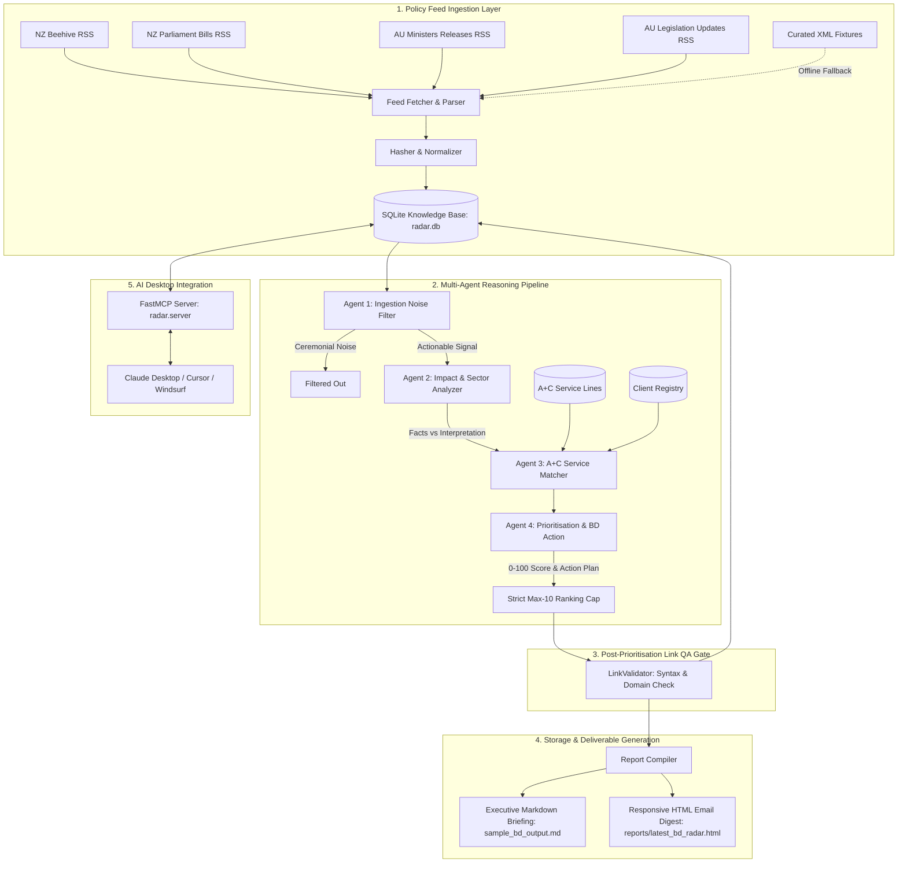

# Allen + Clarke Business Development Opportunity Radar

[](https://www.python.org/downloads/)
[](https://modelcontextprotocol.io/)
[](https://www.langchain.com/)
[](https://www.sqlite.org/)
[-success.svg)](tests/)
[]()

> **Fortnightly Public Sector Policy Ingestion, Multi-Agent Opportunity Reasoning, and Business Development Automation for Allen + Clarke Consulting.**

---

## Table of Contents

- [Overview](#overview)
- [Key Capabilities](#key-capabilities)
- [System Architecture](#system-architecture)
  - [End-to-End Pipeline Workflow](#end-to-end-pipeline-workflow)
  - [4-Agent LangChain Reasoning Pipeline](#4-agent-langchain-reasoning-pipeline)
  - [The 6 Mandatory Consulting Evaluation Questions](#the-6-mandatory-consulting-evaluation-questions)
  - [Fact vs. Interpretation Separation](#fact-vs-interpretation-separation)
- [Prioritisation & Scoring Rubric](#prioritisation--scoring-rubric)
- [Allen + Clarke Knowledge Base](#allen--clarke-knowledge-base)
  - [The 8 Core Practice Lines](#the-8-core-practice-lines)
  - [Client Directory (NZ & AU)](#client-directory-nz--au)
- [Installation & Quickstart](#installation--quickstart)
- [CLI User Guide (`run_scan.py`)](#cli-user-guide-run_scanpy)
  - [Command-Line Arguments](#command-line-arguments)
  - [Example Commands](#example-commands)
  - [Sample Console Output](#sample-console-output)
- [Deliverables & Report Outputs](#deliverables--report-outputs)
  - [Executive Markdown Briefing](#executive-markdown-briefing)
  - [Responsive HTML Email Digest](#responsive-html-email-digest)
  - [1-Page Client Outreach Email & Pitch Briefs](#1-page-client-outreach-email--pitch-briefs)
- [FastMCP Server & AI Desktop Integration](#fastmcp-server--ai-desktop-integration)
  - [Starting the FastMCP Server](#starting-the-fastmcp-server)
  - [Claude Desktop Configuration](#claude-desktop-configuration)
  - [Cursor / Windsurf Configuration](#cursor--windsurf-configuration)
  - [Exposed MCP Tools Reference](#exposed-mcp-tools-reference)
- [Quality Assurance & Testing](#quality-assurance--testing)
- [Repository Structure](#repository-structure)
- [Confidentiality & License](#confidentiality--license)

---

## Overview

The **Allen + Clarke Business Development Opportunity Radar** is an automated intelligence system designed to solve the consulting business development challenge: **signal-to-noise overload in public policy monitoring**.

Every fortnight, government agencies across New Zealand and Australia release hundreds of ministerial announcements, bills, gazette notices, royal commissions, inquiry terms of reference, and statutory reviews. Consulting partners and practice leads lack the time to manually sift through raw feeds to find high-probability consulting leads.

The BD Opportunity Radar automates this process:
1. **Ingests** policy feeds across New Zealand (`Beehive`, `NZ Parliament`) and Australia (`Federal Register of Legislation`, `Australian Ministers / PM&C`).
2. **Normalizes & Deduplicates** items using deterministic SHA-256 content hashing.
3. **Applies a 4-Agent Multi-Agent Reasoning Pipeline** powered by LangChain and structured Pydantic schemas to filter noise, extract verified facts vs. consulting interpretations, match opportunities against Allen + Clarke's authentic 8 service lines and client registry, and score opportunities on an objective 0–100 scale.
4. **Validates links** through a post-prioritisation QA validation gate.
5. **Generates dual executive deliverables**: a publication-ready Executive Markdown briefing (`sample_bd_output.md`) and a responsive, color-coded HTML Email Digest (`reports/latest_bd_radar.html`).
6. **Exposes a FastMCP Server** with 4 dedicated tools allowing AI desktop clients (Claude Desktop, Cursor) to run on-demand scans, search opportunities, generate tailored client outreach emails, and update client intelligence.

---

## Key Capabilities

- 🇳🇿 🇦🇺 **Bi-Jurisdictional Coverage**: First-class support for New Zealand (Crown, Ministries, Territorial Authorities) and Australian (Commonwealth, State/Territory) policy environments.
- ⚡ **Deterministic Deduplication**: Normalizes feed text and computes SHA-256 hashes to suppress duplicate scans across cycles.
- 🤖 **4-Agent LangChain Pipeline**:
  - **Agent 1 (Noise Filter)**: Rejects ceremonial politics, ribbon-cuttings, awards, sports congratulations, and photo-ops.
  - **Agent 2 (Impact & Sector Analyzer)**: Extracts affected agencies, compliance deadlines, and operational obligations, strictly isolating verified statutory facts from consulting interpretations.
  - **Agent 3 (A+C Service Matcher)**: Maps opportunities to A+C's 8 service lines and active/historical client directory.
  - **Agent 4 (Prioritisation & Action Formulation)**: Scores each opportunity against the 0–100 rubric, picks the target contact persona, formulates bespoke conversation starters, and enforces a strict max-10 ranking cap.
- 🛡️ **Post-Prioritisation Link QA Gate**: Validates URL structure, checks authoritative government domains (`.govt.nz`, `.parliament.nz`, `.gov.au`, `.aph.gov.au`, `.legislation.gov.au`), and optionally tests HTTP reachability.
- 📊 **Executive Dual Deliverables**:
  - `sample_bd_output.md`: Comprehensive Markdown report addressing the 6 mandatory consulting evaluation questions.
  - `reports/latest_bd_radar.html`: Standalone, mobile-responsive HTML email digest with progress bars, status pills, and comparison boxes.
- 🔌 **FastMCP Server**: Standardized Model Context Protocol (MCP) server running on `stdio` or `SSE`, exposing 4 tools for conversational BD workflows in Claude Desktop and Cursor.
- ✉️ **1-Page Pitch Brief Generator**: Turns any opportunity into a tailored executive brief, structured talking points, and a ready-to-send outreach email addressing specific client pain points.
- 💾 **Embedded SQLite Knowledge Base**: Persists service lines, client directory, raw scans, relationship notes, and opportunity history with zero external database dependencies.
- 📴 **Zero-Network Fixture Fallback**: Includes authentic curated RSS/Atom XML fixtures for offline testing, demos, and network resilience.

---

## System Architecture

### End-to-End Pipeline Workflow



---

### 4-Agent LangChain Reasoning Pipeline

| Agent | Responsibility | Input | Output Model |
| :--- | :--- | :--- | :--- |
| **Agent 1: Ingestion Noise Filter** | Filters out ceremonial politics, congratulations, photo-ops, and non-actionable administrative churn. | `ScanRecord` | `FilterResult` (`is_actionable`, `novelty_score`, `rejection_reason`) |
| **Agent 2: Impact & Sector Analyzer** | Extracts affected agencies, operational obligations, and statutory deadlines; strictly separates facts from strategic consulting interpretations. | `ScanRecord` | `ImpactAnalysis` (`verified_facts`, `strategic_interpretation`, `affected_sectors`, `affected_agencies`, `operational_obligations`, `compliance_deadlines`, `citations`) |
| **Agent 3: A+C Service Matcher** | Matches policy developments to Allen + Clarke practice taxonomy and client directory with rationale and past engagement context. | `ScanRecord`, `ImpactAnalysis`, `ServiceLines`, `Clients` | `ServiceMatch` (`primary_service_line_id`, `secondary_service_line_ids`, `target_client_id`, `target_client_name`, `service_offering_summary`, `fit_rationale`) |
| **Agent 4: Prioritisation & BD Action** | Applies the 0–100 rubric, selects the target decision-maker persona, formulates conversation starters and pitch angles, and caps top 10. | `ScanRecord`, `ImpactAnalysis`, `ServiceMatch` | `BDOpportunity` (`score`, `target_contact_persona`, `conversation_starter`, `key_pitch_angles`, `status`) |

---

### The 6 Mandatory Consulting Evaluation Questions

Every prioritized opportunity in the deliverables strictly addresses the **6 Mandatory Consulting Questions**:

```
├── Q1: What has changed or is changing?
│   └── Concise summary of the policy shift, enacted bill, or inquiry terms of reference.
├── Q2: Verified Facts vs Strategic Interpretation
│   ├── Verified Statutory Facts (dates, official authorities, specific citations, bill numbers)
│   └── Strategic Consulting Interpretation (capacity constraints, delivery risks, advisory needs)
├── Q3: Affected Public Sector Organisations & Sectors
│   └── Primary target agencies, crown entities, local government bodies, and affected sectors.
├── Q4: Operational Obligations & Timelines
│   ├── Specific operational obligations (regulatory design, evaluation frameworks, iwi consultation)
│   └── Compliance deadlines & statutory implementation milestones.
├── Q5: Allen + Clarke Service Line Fit
│   ├── Primary recommended practice line & secondary capabilities
│   └── Tailored capability alignment and concrete service offering.
└── Q6: BD Action Plan & Outreach Strategy
    ├── Target contact persona (e.g. Deputy Secretary, General Manager Evidence & Insights)
    ├── Conversational outreach starter & entry angle
    └── Key value propositions and pitch angles.
```

---

### Fact vs. Interpretation Separation

To maintain absolute credibility with government clients, the radar strictly segregates objective factual data from analytical consulting commentary:

- **Verified Statutory Facts**: Contains only verifiable information present in the source legislation, ministerial release, or gazette notice (e.g., *Act names, gazetted dates, named review chairs, statutory delivery dates, explicit budgetary appropriations*).
- **Strategic Consulting Interpretation**: Contains Allen + Clarke's advisory assessment of the machinery of government impact (e.g., *agency capacity bottlenecks, operational ambiguity, urgent need for independent programme evaluation, risk of non-compliance*).

---

## Prioritisation & Scoring Rubric

Opportunities are ranked using an objective **0–100 Prioritisation Rubric**:

$$\text{Total Score} = \text{Strategic Fit (0--35)} + \text{Statutory Urgency (0--35)} + \text{Budget Likelihood (0--30)}$$

| Scoring Dimension | Weight | Scoring Criteria & Signals |
| :--- | :---: | :--- |
| **1. Strategic Fit** | **0–35 pts** (35%) | • Direct alignment with one of A+C's 8 core practice lines (+20 pts base)<br>• Active or historical client relationship in knowledge base (+7 pts)<br>• Multi-disciplinary cross-service synergy (+4 pts)<br>• Alignment with Kaupapa Māori & Pacific advisory capability (+4 pts) |
| **2. Statutory Urgency** | **0–35 pts** (35%) | • Imminent statutory deadline or milestone within upcoming 6–12 months (+10 pts)<br>• Multiple complex operational deliverables required (+6 pts)<br>• Active legislative reform or royal commission driving procurement (+4 pts)<br>• Base policy implementation timeline (+15 pts base) |
| **3. Budget Likelihood** | **0–30 pts** (30%) | • Established departmental procurement route / panel membership (+6 pts)<br>• Mandated statutory review or evaluation with allocated budget (+5 pts)<br>• High public sector consulting spend propensity in domain (+4 pts)<br>• Standard funding envelope (+15 pts base) |

### Score Threshold Tiers
- 🟢 **High Priority (80–100)**: Immediate partner outreach; statutory deadlines within 6 months or major operating model review.
- 🟡 **Medium Priority (65–79)**: Active monitoring and scheduled relationship touchpoint within upcoming month.
- ⚪ **Monitor (< 65)**: Early-stage signal or long-range legislative reform; logged in knowledge base for future cycles.

---

## Allen + Clarke Knowledge Base

### The 8 Core Practice Lines

Sourced directly from authentic Allen + Clarke capabilities:

1. **Policy + Regulation (`policy-regulation`)**: Legislative reform, regulatory impact analysis, bill drafting support, select committee submissions analysis (e.g., *Therapeutics Products Bill*, *Fast-Track Approvals Bill*).
2. **Evaluation + Review (`evaluation-review`)**: Formative and summative evaluation, realist evaluation, M&E frameworks, statutory reviews (e.g., *Victorian Disability Liaison Officer Program Evaluation*, *Australia's National Cancer Plan Review*).
3. **Strategy + Planning (`strategy-planning`)**: Strategic planning, target operating models, machinery of government transitions, system architecture.
4. **Business Change & Public Sector Governance (`transformation-governance`)**: Public sector reform, governance reviews, organizational design, change management.
5. **Kaupapa Māori & Pacific Policy (`kaupapa-maori-pacific`)**: Te Tiriti o Waitangi / Treaty analysis, iwi partnership frameworks, Pacific development cooperation (e.g., *Pacific Fisheries Review*, *Tuvalu Development Program*).
6. **Performance + Optimisation (`performance-optimisation`)**: Service delivery optimization, workflow design, operational efficiency reviews.
7. **Risk Management (`risk-management`)**: Regulatory risk modeling, compliance frameworks, integrity assessments.
8. **Secretariat + Service Delivery (`secretariat-service-delivery`)**: Management of independent inquiry panels, ministerial advisory secretariats, stakeholder consultation logistics.

---

### Client Directory (NZ & AU)

The embedded SQLite knowledge base includes pre-seeded profiles for major public sector clients:

- **New Zealand**:
  - *Ministries*: Ministry of Health (Manatū Hauora), Ministry of Justice, Ministry for Primary Industries (MPI), Ministry for the Environment (MfE), Ministry of Foreign Affairs and Trade (MFAT), Te Puni Kōkiri.
  - *Crown Entities & Agencies*: Health New Zealand (Te Whatu Ora), ACC, Oranga Tamariki, Treasury NZ.
- **Australia (Commonwealth & State)**:
  - *Commonwealth Departments*: Department of Health and Aged Care, Department of Social Services (DSS), Attorney-General's Department, Department of the Prime Minister and Cabinet (PM&C), DCCEEW.
  - *Commissions & Authorities*: NDIS Quality and Safeguards Commission, Cancer Australia, Aged Care Quality and Safety Commission.
  - *State Agencies*: Victorian Department of Health, NSW Health, Queensland Health, Victorian Department of Premier and Cabinet.

---

## Installation & Quickstart

### Prerequisites
- **Python 3.11** or higher
- **Git**

### 1. Clone the Repository
```bash
git clone https://github.com/beastob/allen-clarke-bd-opportunity-radar.git
cd allen-clarke-bd-opportunity-radar
```

### 2. Create and Activate a Virtual Environment
```bash
# Windows (PowerShell)
python -m venv .venv
.\.venv\Scripts\Activate.ps1

# macOS / Linux
python3 -m venv .venv
source .venv/bin/activate
```

### 3. Install Dependencies
```bash
# Install in editable development mode
pip install -e ".[dev]"
```

### 4. Run Your First Scan (Instant Demo)
```bash
python run_scan.py --offline
```
This initializes the SQLite database (`radar.db`), seeds the A+C practice lines and client directory, ingests the curated NZ & AU government fixtures, executes the 4-agent reasoning pipeline, and generates both `sample_bd_output.md` and `reports/latest_bd_radar.html`.

---

## CLI User Guide (`run_scan.py`)

The CLI runner provides a straightforward command-line interface for executing scanning cycles, customizing jurisdictions, adjusting item caps, and choosing between live feeds and curated fixtures.

```
usage: run_scan.py [-h] [-j {NZ,AU,ALL}] [-m MAX_ITEMS] [--offline | --no-offline]
                   [--db-path DB_PATH] [--output-dir OUTPUT_DIR]
                   [--markdown-output MARKDOWN_OUTPUT] [--seed] [-v] [-q]
```

### Command-Line Arguments

| Flag | Long Argument | Type | Default | Description |
| :--- | :--- | :---: | :---: | :--- |
| `-j` | `--jurisdiction` | `str` | `ALL` | Target jurisdiction to scan: `NZ` (New Zealand), `AU` (Australia), or `ALL`. |
| `-m` | `--max-items` | `int` | `10` | Maximum number of top-scoring opportunities to include in deliverables (max: 10). |
| | `--offline` / `--no-offline` | `bool` | `True` | Run in offline fixture mode (`--offline`) or live web scraping mode (`--no-offline`). |
| | `--db-path` | `str` | `radar.db` | Path to the SQLite knowledge base file. |
| | `--output-dir` | `str` | `reports` | Directory where HTML digests and markdown reports are saved. |
| | `--markdown-output` | `str` | `sample_bd_output.md` | Path for the executive candidate Markdown deliverable. |
| | `--seed` | `flag` | `False` | Force re-seeding the knowledge base with A+C practice lines and clients. |
| `-v` | `--verbose` | `flag` | `False` | Enable verbose debug logging output. |
| `-q` | `--quiet` | `flag` | `False` | Suppress console banners and tables for silent automation. |

---

### Example Commands

#### 1. Default Offline Scan (All Jurisdictions, Top 10)
```bash
python run_scan.py
```

#### 2. New Zealand Only Scan with Top 5 Items
```bash
python run_scan.py -j NZ -m 5
```

#### 3. Australia Only Scan
```bash
python run_scan.py -j AU
```

#### 4. Live Web Scraping Mode (Requires Internet Connection)
```bash
python run_scan.py --no-offline -j ALL
```

#### 5. Force Re-seed Knowledge Base and Output to Custom Directory
```bash
python run_scan.py --seed --output-dir custom_reports --markdown-output executive_brief.md
```

---

### Sample Console Output

```text
================================================================================
   ALLEN + CLARKE BUSINESS DEVELOPMENT OPPORTUNITY RADAR
   Fortnightly Policy Ingestion & Multi-Agent Opportunity Reasoning
================================================================================
 Jurisdictions : ALL
 Mode          : Offline Curated Fixtures
 Max Items     : 10
 Database      : radar.db
 Output Dir    : reports
--------------------------------------------------------------------------------

[1/3] Ingesting government policy feeds and checking SHA-256 hashes...
      [+] Total items fetched: 10
      [+] New items ingested: 10
      [+] Duplicates skipped: 0

[2/3] Executing 4-Agent LangChain Opportunity Reasoning Pipeline...
      - Agent 1: Ingestion Noise Filter
      - Agent 2: Impact & Sector Analysis (Fact vs. Interpretation)
      - Agent 3: A+C Service Line & Client Registry Matching
      - Agent 4: Prioritisation Scoring (0-100) & BD Action Plan
      [+] Items processed: 10
      [+] Noise filtered: 0
      [+] Opportunities qualified & saved: 10

[3/3] Compiling Executive Markdown Report & HTML Email Digest...
      [+] Executive Markdown Report: C:\Projects\allen-clarke-bd-opportunity-radar\sample_bd_output.md
      [+] HTML Email Digest:        C:\Projects\allen-clarke-bd-opportunity-radar\reports\latest_bd_radar.html
      [+] Reports Markdown Copy:     C:\Projects\allen-clarke-bd-opportunity-radar\reports\latest_bd_radar.md

================================================================================
   TOP PRIORITISED BUSINESS DEVELOPMENT OPPORTUNITIES
================================================================================
Rank  Score    Jur  Target Agency                Service Line              
--------------------------------------------------------------------------------
#1    92/100   NZ   Health New Zealand (Te Wha.. Evaluation + Review       
      Title : Government initiates independent review of public hospital planned care operating models
      Persona: General Manager / Director, Evidence, Insights & Evaluation
      Opener : "Kia ora / Dear General Manager, following the recent announcement regardi..."
--------------------------------------------------------------------------------
#2    79/100   AU   Responsible Commonwealth D.. Policy + Regulation       
      Title : Aged Care Act 2026 (Act No. 45 of 2026)
      Persona: Deputy Secretary / Executive Director, Policy & Regulatory Reform
      Opener : "Kia ora / Dear Deputy Secretary, following the recent announcement regard..."
--------------------------------------------------------------------------------
#3    79/100   NZ   Responsible NZ Government .. Policy + Regulation       
      Title : Health and Disability Services (System Oversight and Standards) Amendment Bill
      Persona: Deputy Secretary / Executive Director, Policy & Regulatory Reform
      Opener : "Kia ora / Dear Deputy Secretary, following the recent announcement regard..."
--------------------------------------------------------------------------------

Scan completed successfully.
================================================================================
```

---

## Deliverables & Report Outputs

### Executive Markdown Briefing

- **Location**: `sample_bd_output.md` (and copied to `reports/latest_bd_radar.md`)
- **Structure**:
  1. Executive Summary & Period Metadata
  2. Prioritisation Matrix Table (Rank, Total Score, Fit/Urgency/Budget breakdowns, Target Agency, Service Line)
  3. Structured Opportunity Deep Dives (Strictly answering Questions Q1 through Q6 for each item)

### Responsive HTML Email Digest

- **Location**: `reports/latest_bd_radar.html`
- **Features**:
  - Dark-mode header with Allen + Clarke branding
  - Real-time executive metrics bar (Qualified Opportunities, High Priority Count, Total Ingested)
  - Color-coded priority badges (🟢 High $\ge 80$, 🟡 Medium $\ge 65$, ⚪ Monitor $< 65$)
  - Dimension progress breakdown bars (Strategic Fit `/35`, Urgency `/35`, Budget `/30`)
  - Two-tone callout boxes for **Verified Statutory Facts** (Blue) vs. **Strategic Consulting Interpretation** (Purple)
  - Business Development Action Plan cards with target personas, direct quotes for email openers, and pitch angles.

---

### 1-Page Client Outreach Email & Pitch Briefs

Using the `generate_pitch_brief` MCP tool or `PitchGenerator`, the radar creates complete 1-page outreach packs for any opportunity:

```text
Subject: Allen + Clarke | Advisory Brief: Health New Zealand (Te Whatu Ora) - Review of Planned Care Operating Models

Dear Dr. Jenkins,

I hope this note finds you well. I am reaching out from Allen + Clarke regarding the recent developments concerning the independent review of public hospital planned care operating models.

With the latest statutory directives indicating: "Terms of reference gazetted on 31 August 2026 requiring system operating model assessment within upcoming 6-12 month window", we recognize that Health New Zealand (Te Whatu Ora) may be assessing capacity and operational requirements to implement these mandates effectively.

From our work supporting public sector leaders across NZ, we know that internal teams face immediate surge capacity constraints when delivering high-stakes statutory reviews under tight timelines.

Our Evaluation + Review practice regularly partners with health sector agencies on evidence-based operating model reviews, clinical pathway evaluation, and commissioning framework design (for example, our recent work on the Victorian Disability Liaison Officer Program Evaluation).

Building on Allen + Clarke's prior engagements with Health New Zealand around clinical governance and commissioning frameworks, we are well-positioned to deliver rapid, high-trust support.

Would you or your team have 20 minutes next week for an informal briefing to discuss our observations and how we might support your upcoming milestones?

Warm regards,

Business Development Practice Lead
Allen + Clarke Policy and Regulatory Specialists
```

---

## FastMCP Server & AI Desktop Integration

The radar includes a high-performance **FastMCP Server** (`radar.server`) that allows desktop AI agents like **Claude Desktop**, **Cursor**, or **Windsurf** to directly trigger scans, search past opportunities, generate client outreach briefs, and update relationship context via natural conversation.

### Starting the FastMCP Server

```bash
# Mode 1: stdio transport (Standard for Claude Desktop & Cursor)
python -m radar.server --transport stdio

# Mode 2: SSE transport (HTTP Server on port 8000)
python -m radar.server --transport sse --host 127.0.0.1 --port 8000
```

---

### Claude Desktop Configuration

Add the following to your `claude_desktop_config.json`:

- **Windows**: `%APPDATA%\Claude\claude_desktop_config.json`
- **macOS**: `~/Library/Application Support/Claude/claude_desktop_config.json`

```json
{
  "mcpServers": {
    "allen-clarke-radar": {
      "command": "C:\\Projects\\allen-clarke-bd-opportunity-radar\\.venv\\Scripts\\python.exe",
      "args": [
        "-m",
        "radar.server",
        "--transport",
        "stdio",
        "--db-path",
        "C:\\Projects\\allen-clarke-bd-opportunity-radar\\radar.db"
      ]
    }
  }
}
```

---

### Cursor / Windsurf Configuration

In `.cursor/mcp.json` or Cursor Settings $\rightarrow$ Features $\rightarrow$ MCP:

```json
{
  "mcpServers": {
    "allen-clarke-radar": {
      "command": "python",
      "args": [
        "-m",
        "radar.server",
        "--transport",
        "stdio"
      ]
    }
  }
}
```

---

### Exposed MCP Tools Reference

#### 1. `trigger_policy_scan`
Executes an on-demand scan across NZ and AU policy feeds and returns ranked opportunities.
- **Parameters**:
  - `jurisdiction` (*string*, optional): `'NZ'`, `'AU'`, or `'ALL'`. Defaults to `'ALL'`.
  - `use_fixtures` (*boolean*, optional): When `True`, uses curated policy fixtures instead of live web feeds. Defaults to `False`.
  - `max_items` (*integer*, optional): Maximum number of opportunities to return. Defaults to `10`.
- **Returns**: Full scan summary and structured opportunity objects.

#### 2. `query_opportunities`
Searches the SQLite knowledge base for ranked opportunities filtered by client, sector, jurisdiction, or score.
- **Parameters**:
  - `client` (*string*, optional): Filter by client name or ID (e.g. `'Health New Zealand'` or `'nz-healthnz'`).
  - `sector` (*string*, optional): Filter by sector (e.g. `'Health'`, `'Environment'`, `'Social Services'`).
  - `jurisdiction` (*string*, optional): `'NZ'`, `'AU'`, or `'ALL'`.
  - `min_score` (*integer*, optional): Minimum total priority score (0–100). Defaults to `0`.
  - `limit` (*integer*, optional): Maximum opportunities to retrieve. Defaults to `20`.
- **Returns**: List of matching opportunity records joined with client and service line metadata.

#### 3. `generate_pitch_brief`
Generates a personalized 1-page client outreach email draft, talking points, and strategic action plan for a specific opportunity.
- **Parameters**:
  - `opportunity_id` (*string*, required): Target opportunity ID (e.g. `'opp-2d65d8ee'`).
  - `contact_name` (*string*, optional): Name of the client decision-maker (e.g. `'Dr. Sarah Jenkins'`).
  - `custom_angle` (*string*, optional): Specific strategic focal point or entry angle to emphasize.
- **Returns**: Formatted 1-page markdown brief, ready-to-send email subject/body, talking points, and recommended next steps.

#### 4. `add_client_context`
Ingests meeting notes, relationship updates, and intelligence into the client registry.
- **Parameters**:
  - `client_id` (*string*, required): Client identifier or name (e.g. `'nz-healthnz'` or `'Health New Zealand'`).
  - `relationship_notes` (*string*, required): Notes, meeting intelligence, or strategic relationship updates.
  - `append` (*boolean*, optional): When `True` (default), appends notes with an ISO timestamp; when `False`, replaces existing notes.
- **Returns**: Updated client record.

---

## Quality Assurance & Testing

The codebase includes an automated test suite covering all architecture seams:

```bash
# Run all tests
pytest

# Run tests with detailed verbose output
pytest -v

# Run tests with code coverage report
pytest --cov=src --cov-report=term-missing
```

### Test Suite Structure (67 Passing Tests)

- **Database & Knowledge Base (`tests/test_db.py`, `tests/test_db_queries.py`)**: Schema creation, idempotent seeding of A+C service lines and clients, CRUD operations, multi-token client search, and relational filtering.
- **Ingestion & Normalization (`tests/test_hasher.py`, `tests/test_fetcher.py`, `tests/test_ingestion_engine.py`)**: Deterministic SHA-256 hashing, HTML sanitization, feed parsing, jurisdiction filtering, offline fixture fallback, and duplicate suppression.
- **Multi-Agent Pipeline (`tests/test_filter_agent.py`, `tests/test_analyzer_agent.py`, `tests/test_matcher_agent.py`, `tests/test_scoring_agent.py`, `tests/test_pipeline_orchestrator.py`, `tests/test_pipeline_models.py`)**:
  - Noise filter rejection of ceremonial events and acceptance of policy signals.
  - Strict demarcation of verified facts vs. strategic interpretation.
  - Accurate mapping to A+C practice taxonomy and client accounts.
  - 0–100 scoring calibration and strict max-10 ranking cap enforcement.
- **Link QA Validation (`tests/test_link_validator.py`)**: Government domain verification, URL syntax validation, and HTTP reachability checks.
- **Briefing & Outreach (`tests/test_pitch_generator.py`)**: Salutation formatting, custom angle injection, past engagement references, and ready-to-send email drafting.
- **Deliverable Compilers (`tests/test_markdown_generator.py`, `tests/test_html_generator.py`, `tests/test_report_compiler.py`)**: 6-question Markdown compliance, responsive HTML rendering, score breakdown bars, and file persistence.
- **FastMCP Server (`tests/test_mcp_server.py`)**: Tool registration, parameter validation, scan execution, opportunity querying, pitch brief generation, and client context updates.
- **CLI Runner (`tests/test_cli_runner.py`)**: CLI argument parsing, end-to-end execution, and console output formatting.

---

## Repository Structure

```text
allen-clarke-bd-opportunity-radar/
├── pyproject.toml               # Project metadata, dependencies, and test config
├── requirements.txt             # Pip requirements file
├── run_scan.py                  # Root CLI demo executable
├── sample_bd_output.md          # Generated Fortnightly Executive Markdown Briefing
├── radar.db                     # Embedded SQLite Knowledge Base
├── reports/                     # Output directory for generated deliverables
│   ├── latest_bd_radar.html     # Responsive HTML Email Digest
│   └── latest_bd_radar.md       # Archived Markdown report copy
├── src/
│   └── radar/                   # Core Python package
│       ├── __init__.py
│       ├── __main__.py          # Package entrypoint (python -m radar)
│       ├── cli.py               # CLI runner & console formatter
│       ├── models.py            # Core Pydantic data models
│       ├── server.py            # FastMCP Server (stdio & SSE transports)
│       ├── briefing/
│       │   ├── __init__.py
│       │   └── pitch_generator.py  # 1-Page Pitch Brief & Email Draft Generator
│       ├── data/
│       │   ├── seed_clients.json       # Seed NZ & AU public sector client registry
│       │   ├── seed_service_lines.json # Seed authentic A+C practice lines
│       │   └── fixtures/               # Curated RSS/Atom XML fallback fixtures
│       │       ├── au_legislation_fixture.xml
│       │       ├── au_ministers_fixture.xml
│       │       ├── nz_beehive_fixture.xml
│       │       └── nz_parliament_fixture.xml
│       ├── db/
│       │   ├── __init__.py
│       │   ├── database.py      # SQLite DatabaseManager with WAL mode
│       │   ├── schema.sql       # Relational schema (tables, indexes, foreign keys)
│       │   └── seed.py          # Idempotent seed populator
│       ├── ingestion/
│       │   ├── __init__.py
│       │   ├── engine.py        # Ingestion engine coordinator
│       │   ├── fetcher.py       # HTTP RSS/Atom fetcher with fixture fallback
│       │   ├── hasher.py        # SHA-256 canonical hasher
│       │   ├── parser.py        # Feed entry and HTML sanitization parser
│       │   └── registry.py      # Authoritative NZ & AU feed registry
│       ├── pipeline/
│       │   ├── __init__.py
│       │   ├── analyzer_agent.py  # Agent 2: Impact & Sector Analyzer (Facts vs Interpretation)
│       │   ├── filter_agent.py    # Agent 1: Ingestion Noise Filter
│       │   ├── matcher_agent.py   # Agent 3: A+C Service Line & Client Matcher
│       │   ├── models.py          # Pipeline Pydantic data schemas
│       │   ├── orchestrator.py    # 4-Agent Pipeline Orchestrator
│       │   ├── prompts.py         # System prompts for LangChain structured LLMs
│       │   ├── scoring_agent.py   # Agent 4: Prioritisation & BD Action Agent
│       │   └── validator.py       # Post-Prioritisation Link QA Gate
│       └── reporting/
│           ├── __init__.py
│           ├── compiler.py        # Report compiler coordinating Markdown & HTML
│           ├── html_generator.py  # Responsive HTML Email Digest generator
│           ├── markdown_generator.py # Executive Markdown report generator
│           └── models.py          # Reporting metadata models
└── tests/                       # Complete pytest test suite (67 tests)
    ├── conftest.py
    ├── test_analyzer_agent.py
    ├── test_cli_runner.py
    ├── test_db.py
    ├── test_db_queries.py
    ├── test_fetcher.py
    ├── test_filter_agent.py
    ├── test_hasher.py
    ├── test_html_generator.py
    ├── test_ingestion_engine.py
    ├── test_link_validator.py
    ├── test_markdown_generator.py
    ├── test_matcher_agent.py
    ├── test_mcp_server.py
    ├── test_pipeline_models.py
    ├── test_pipeline_orchestrator.py
    ├── test_pitch_generator.py
    ├── test_report_compiler.py
    └── test_scoring_agent.py
```

---

## Confidentiality & License

This project and its contents are **Confidential** and developed for internal use by **Allen + Clarke Policy and Regulatory Specialists** (Auckland • Wellington • Melbourne • Canberra).

For questions or support, contact the Business Development & Practice Leadership Team.
